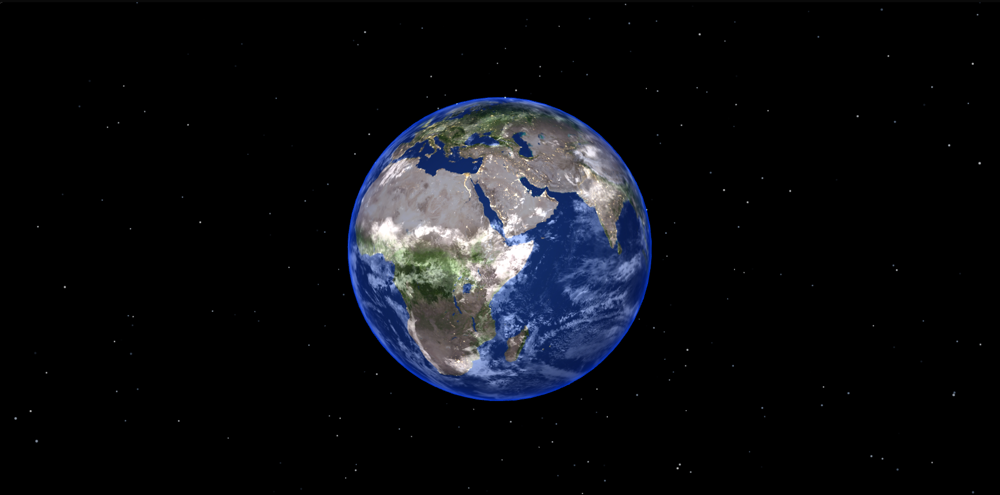

# Three Hello World



A tiny Three.js scene featuring Earth floating in space. This project is intentionally simple and is meant as a clean starting point for experimenting with basic 3D scenes, lighting, and camera setup.

## What it shows

- A small Earth object in a space-themed scene
- Basic Three.js rendering setup
- A lightweight project structure that is easy to extend

## Getting started

```bash
npm install
npm run dev
```

## Preview

The gif below gives a quick look at the scene:


